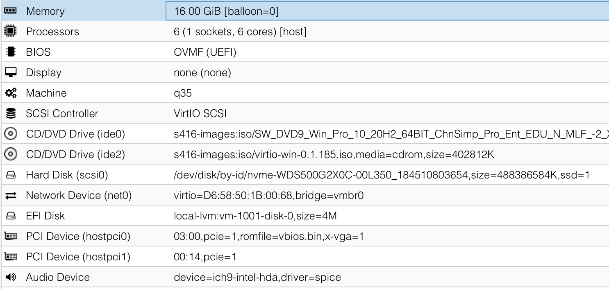

# Proxmox VE Configuration

This repository records some of the processes I used to configure Proxmox VE, particularly for GPU (PCIe) passthrough and NIC SR-IOV. Hope this will be helpful for you.

### !! Updates

I've recently upgrade my desktop to AMD Ryzen platform. Some configurations are changed, especially graphics due to lack of an integrated one. Check out [this revision](https://github.com/BugenZhao/pve-config/tree/93f4c4ef0f2933da1c0dd67536ece86f15d27fee) if you're on a Intel CPU with integrated graphics.

## Environment

- CPU: AMD Ryzen 9 5900X 12-Core Processor
- Memory: 48 GiB DDR4
- Graphics:
  - AMD Radeon RX 5700 XT
  - NVIDIA Geforce GT 710
- Motherboard: MSI B550M Mortar WiFi
- Proxmox: 6.4
- Kernel: 5.4.128-1-pve
- Guest:
  - Windows 10 21H1
  - Ubuntu 20.10

## Host Configuration

### Repositories

See https://pve.proxmox.com/wiki/Package_Repositories

### BIOS Options

Just remember to turn on the CPU virtualization feature, and SR-IOV support if needed.

### Kernel Options

- `/etc/default/grub`

  - Explanations:

    - `pcie_acs_override`

      Devices are divided into IOMMU groups, however a whole group of devices must be passthoughed at the same time to the VM. This option makes it possible to passthrough a single graphic card on some desktop motherboards. Note that it is the feature of a kernel patch, and Proxmox VE includes it.

    - `pci=assign-bussus`

      May be useful to assign PCIe port numbers to SR-IOV NICs (and passthrough USB controller?) for some desktop motherboards.

    - `kvm.ignore_msrs=1`

      May be useful for Nvidia card on Windows guests (v1804-v19xx)? This can also be set in `vfio` configuration file. Keep reading.

    - `nomodeset nofb video=xxx:off`

      Another way to avoid Linux loading the graphics. For instance, `video=xxx:off` will freeze the video after `initramfs` is loaded. It seems not compatiable with "-hypervisor" flag?

      Assuming that you will boot the computer with HDMI/DP cable plugged on your main GPU...

      - If your CPU has an IGD graphics and it is set to be default in BIOS, there seems no need to set these flags.
      - Otherwise, once host kernel begins to output messages into the screen, some of resources of this GPU are allocated and it can NEVER be successfully passthroughed into a guest, with reporting `BAR 0: can't reserve [mem 0xe0000000-0xefffffff 64bit pref]`.<br>In this case, you are actually working under a single-GPU configuration. These options, especially `video=xxx:off`, are **required**. Also, if you don't want to lose the capability of managing the PVE host using Linux TTY, you need to add an extra GPU (better if from a different manufacture).

  - Mine (under the R9-5900X configuration):

    ```bash
    GRUB_CMDLINE_LINUX="amd_iommu=on pcie_acs_override=downstream,multifunction iommu=pt kvm_amd.npt=1 kvm_amd.avic=1 video=efifb:off"
    ```

  - Mine (under the i5-9600K configuration):

    ```bash
    GRUB_CMDLINE_LINUX="intel_iommu=on pcie_acs_override=downstream,multifunction pci=assign-busses"
    ```

  - Full:

    ```bash
    GRUB_CMDLINE_LINUX="intel_iommu=on pcie_acs_override=downstream,multifunction pci=assign-busses nofb nomodeset video=efifb:off,vesafb:off kvm.ignore_msrs=1"
    ```

- `/etc/modules`

  These vfio kernel modules will be loaded at boot for PCIe passthrough.

  ```bash
  vendor-reset # required for Navi 10 cards, see the following sections

  vfio
  vfio_iommu_type1
  vfio_pci
  vfio_virqfd
  ```

- `/etc/modprobe.d/blacklist.conf`

  ```bash
  blacklist amdgpu
  blacklist snd_hda_intel
  blacklist radeon

  blacklist iwlwifi # if you want to passthrough the Intel WiFi
  ```

- `/etc/modprobe.d/vfio.conf` or `/etc/modprobe.d/kvm-vfio.conf`

  Run `lspci -nn` to get the ids for all devices you want to passthrough, like the GPU and its audio device. This will make kernel ignore these devices.

  ```bash
  options vfio_iommu_type1 allow_unsafe_interrupts=1
  options vfio-pci ids=1002:731f,1002:ab38,8086:2723 disable_vga=1
  options kvm ignore_msrs=1
  ```

  Note: there's no need to append the id if just to passthrough a device like USB controller and NVMe. (update: really?)

- `/etc/modprobe.d/igb.conf` (SR-IOV NIC)

  Configure the # of virtual functions of SR-IOV enabled NIC. Note that `igb` is the name of the driver for NIC, modification according to `lspci -nnk` may be required.

  ```bash
  options igb max_vfs=7
  ```

- `/etc/modprobe.d/kvm-intel.conf` (nested virtualization)

  NOT recommended for Windows guests. Enabling the nested virtualization may lead Windows guests to freeze at boot.

  ```bash
  options kvm-intel nested=Y
  ```

- Update kernel and initramfs

  ```bash
  update-initramfs -u
  update-grub
  reboot
  ```

## Guest Configuration

- Add a block device (whole physical disk) as a virtual disk

  ```bash
  qm set 1001 -scsi0 /dev/disk/by-id/nvme-WDS500G2X0C-00L350_184510803654
  ```

  Note: ~~Windows does not support virtio scsi bus natively. Load the disk driver from `virtio-win-0.x.iso/vioscsi/` within the Windows installer.~~ You should also load virtio network at the same time if using a para-virtualized NIC, which is in `NetKVM/`.

  Edit: it is better **NOT** to use para-virtualized SCSI disk or install qemu guest agent (including any irrelavant virtio drivers) on Windows. I'm not sure about what the problem is, but it may cause Windows guest to fail to launch any programs on my machine. Use SATA for a workaround.

  Use `fdisk -l` to check all disks, then `ls -l /sys/block/nvme0n1` to check the device's PCIe port.

- It may be necessary to dump the vbios and provide it to VMs for some Nvidia GPUs.

- Info on the Web UI

  

- `/etc/pve/qemu-server/1001.conf`

  For reference only. You may use SATA bus instead of virtio SCSI for Windows guests to avoid some annoying problems.

  ```bash
  agent: 1  # enable qemu guest agent
  args: -cpu host,-hypervisor  # if you want to hide the hypervisor
  audio0: device=ich9-intel-hda,driver=spice  # just for Steam Link
  balloon: 0  # disable memory ballooning device
  bios: ovmf  # uefi
  boot: dc
  bootdisk: scsi0
  cores: 6
  cpu: host
  efidisk0: local-lvm:vm-1001-disk-0,size=4M
  hostpci0: 03:00,pcie=1,romfile=vbios.bin,x-vga=1  # gpu
  hostpci1: 00:14,pcie=1  # usb
  ide0: s416-images:iso/SW_DVD9_Win_Pro_10_20H2_64BIT_ChnSimp_Pro_Ent_EDU_N_MLF_-2_X22-41514.ISO,media=cdrom,size=5757268K
  # ide1 can't be assigned!
  ide2: s416-images:iso/virtio-win-0.1.185.iso,media=cdrom,size=402812K
  machine: q35  # more stable
  memory: 16384
  name: Windows
  net0: virtio=D6:58:50:1B:00:68,bridge=vmbr0  # para-virtualized
  numa: 0
  onboot: 1
  ostype: win10
  scsi0: /dev/disk/by-id/nvme-WDS500G2X0C-00L350_184510803654,size=488386584K,ssd=1
  scsihw: virtio-scsi-pci  # para-virtualized
  smbios1: uuid=9bb9d862-3fd0-4246-bef1-5f6f14d3f564
  sockets: 1
  startup: up=10
  vga: none  # turn off emulated graphics
  vmgenid: 8d3e6dd9-19f1-4141-8b3f-c3f2d39bd5d0
  ```

## Navi Reset Bug

Navi GPUs cannot be properly reset in current kernel. This bug may cause the VM not to be started again unless we reboot the Proxmox host. Some workarounds are explicitly write reset to the device, or make host sleep and then wake it up, which are not kind of elegant.

~~A kernel patch can be applied to (partially) solve this issue.~~
EDIT: No kernel patches needed now! See the following section.

### Kernel Module

- Module at https://github.com/gnif/vendor-reset

#### How-to

```bash
apt install dkms  # Dynamic Kernel Module Support
gh repo clone gnif/vendor-reset && cd vendor-reset
make clean && make
dkms status  # show installed modules
# dkms remove vendor-reset/0.0.17 --all  # remove old version if needed
dkms install .
```

<details>
<summary>Kernel Patches (OUTDATED)</summary>

### Kernel Patches (OUTDATED)

#### V1

- Patch at https://forum.level1techs.com/t/navi-reset-kernel-patch/147547/46
- VM will be no longer fail to start. However, in many cases, especially when guest reboots, is force-stopped or reset, the GPU will causes the boot process of the VM to be extremely slow, or freezes intermittently, or evens fail to finish (blue screen due to driver watchdog error).

#### V3

- Patch at https://forum.level1techs.com/t/navi-reset-bug-kernel-patch-v2/163103/8
- Works perfectly on graphics, however the audio seems to be broken and the GPU will not be turned off any more after the VM shuts down.

#### How-to

Install the debian packages in this repo directly, or follow the following steps to build your own ones.

- Prereqs

  ```bash
  apt install git-core lintain build-essential automake autoconf libtool
  apt install dh-make libtool sphinx-common dh-python
  apt install asciidoc-base bison flex libdw-dev libelf-dev libiberty-dev libnuma-dev libslang2-dev libssl-dev lz4 xmlto zlib1g-dev

  # remove these packages if has installed any older version before
  dpkg --remove pve-kernel-5.xx-pve
  dpkg --remove pve-headers-5.xx-pve
  ```

- Clone and patch

  ```bash
  git clone git://git.proxmox.com/git/pve-kernel.git --depth 1
  cd pve-kernel
  cp /path/to/patch.patch ./patches/kernel/
  ```

- Make and install

  ```bash
  make
  dpkg -i *.deb
  ```

  </details>

## USB, WiFi, Bluetooth...

For some systems (like my i5-9600K configuration), one can directly passthrough the USB controller of the back-panel to get all these devices passthroughed. While for other systems, this will lead to host kernel panic and then not work. I choose to manually passthrough some USB ports and the PCIe device of the WiFi card. Note that bluetooth may be a separate USB device to passthrough.

## Tricks

- **Ethernet** The driver of the on-board 2.5Gbps ethernet controller of MSI B550M Mortar, named r8125, is not built in the 5.4 kernel. One may load it manually to make it work.
- **M.2 vs the 4th PCIe Slot** Some slots are conflicted on B550 boards! Check the confliction before trying to find out the hardware problem. On my system, a M.2 to PCIe adaptor is required to install the secondary M.2 SSD while placing a debugging-use GPU on the 4th PCIe slot.
- **SCSI** To enable booting an already installed Windows from virtio SCSI disk, follow this:
  https://superuser.com/questions/1057959/windows-10-in-kvm-change-boot-disk-to-virtio/1200899#1200899
- **Image Storage** Add a CIFS storage for samba sharing, and remember to follow the directory structure.
- **Hide Hypervisor** To hide VM signatures, append `args: -cpu host,-hypervisor` to the configuration file.
  Note: **NEVER** leave an empty cpu args like `args: -cpu host`, it may lead to failing to load the GPU driver.

## XPEnology

```
boot: cd
bootdisk: sata0
cores: 2
cpu: host
ide2: none,media=cdrom
memory: 2048
name: DSM
net0: e1000=6A:4F:D1:01:F9:99,bridge=vmbr0
numa: 0
onboot: 1
ostype: l26
sata0: local-lvm:vm-200-disk-1,size=52M,ssd=1
sata1: local-lvm:vm-200-disk-2,size=8G,ssd=1
sata2: /dev/disk/by-id/ata-TOSHIBA_DT01ACA300_79SDGJ7AS,size=2930266584K
scsihw: virtio-scsi-pci
smbios1: uuid=8c29b8e8-6243-44ec-bdd8-d730fba2e889
sockets: 1
startup: up=20
vmgenid: b496c70b-510d-430a-873a-465c03469941
```

## NAT Bridge

1. Enable packet forwarding in `/etc/sysctl.conf`
2. Suppose internet accessed through interface `eth0`, edit `/etc/network/interfaces`

   ```
   auto lo
   iface lo inet loopback

   auto eth0
   iface eth0 inet static
   address YOUR-PUBLIC-STATIC-IP/YOUR-PUBLIC-MASK
   gateway YOUR-STATIC-GATEWAY

   auto vmbr1
   iface vmbr1 inet static
   address 10.10.10.1
   netmask 255.255.255.0
   bridge_ports none
   bridge_stp off
   bridge_fd 0

   post-up iptables -t nat -A POSTROUTING -s '10.10.10.0/24' -o eth0 -j MASQUERADE
   post-down iptables -t nat -D POSTROUTING -s '10.10.10.0/24' -o eth0 -j MASQUERADE
   ```

3. `ifup vmbr1`
4. For VMs, manually set
   - IP: `10.10.10.x/24`
   - Gateway: `10.10.10.1`
